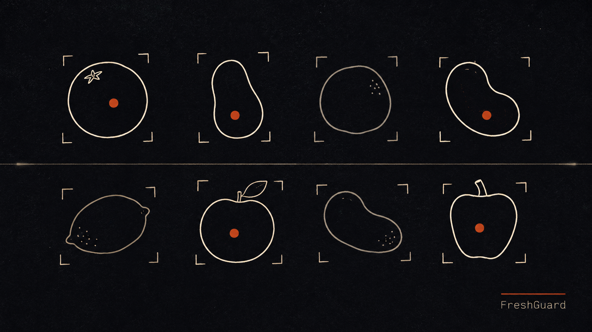
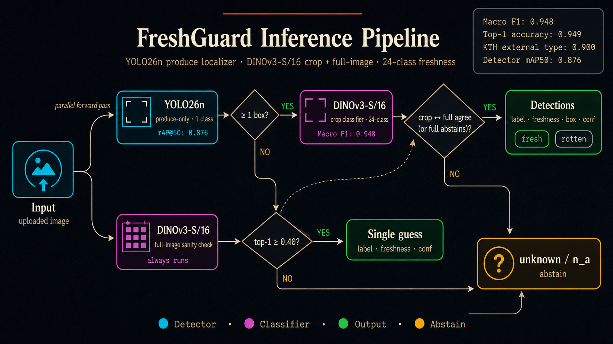
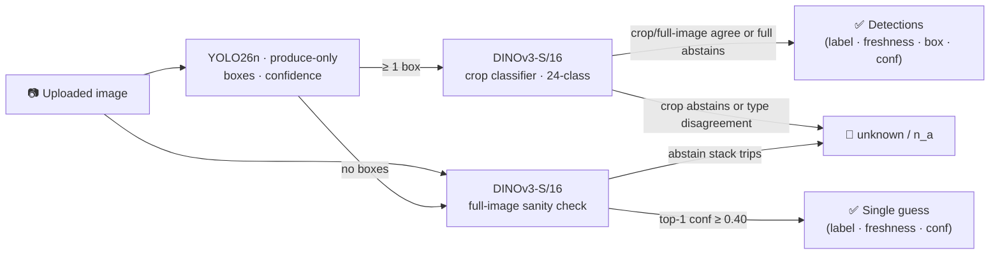

# FreshGuard Vision

> v2 rebuild complete: **YOLO26n produce localization** plus a **DINOv3-S/16 24-class freshness classifier**. Local Streamlit demo, honest cluster-disjoint metrics, and an external KTH GroceryStoreDataset type benchmark.

[Demo](#demo) · [Quickstart](#quickstart) · [Eval report](./eval_report.md) · [Training notebooks](./notebooks/) · [PRD](./PRD.md)

[](https://www.python.org/downloads/release/python-3120/)
[](LICENSE)
[](https://streamlit.io)
[](https://pytorch.org)
[](https://docs.ultralytics.com/models/yolo26/)
[](./eval_report.md)

---

## Demo

End-to-end run through the **Specimen Lab** page: image upload → YOLO26n produce localization → DINOv3-S/16 24-class freshness label per box → confidence + source badges. The final clip exercises the abstain stack on an out-of-distribution image.

<p align="center">
  
</p>

> The GIF is hosted in [the profile repo](https://github.com/Abdulrahman-Elsmmany/Abdulrahman-Elsmmany/tree/main/assets/demos) to keep this repo lean. To run it yourself, follow [Quickstart](#quickstart) below.

---

## Headline results

| Metric                                  | Value      |
| --------------------------------------- | ---------: |
| **Classifier macro F1** (24-class)      | **0.9478** |
| Classifier top-1 accuracy               |   0.9490   |
| **KTH external type accuracy**          | **0.8995** |
| KTH external sample count               |      955   |
| Detector mAP@50                         |   0.8763   |
| Detector mAP@50–95                      |   0.8249   |

Macro F1 is the headline because top-1 accuracy hides minority-class failure under the **41 : 1** class imbalance baked into the source dataset. The KTH row is type-only external evidence; KTH has no fresh/rotten labels, so it is not mixed into the canonical 24-class freshness metric. Numbers come from `eval_report.json`, produced by [`notebooks/kaggle_05_evaluate_v2.ipynb`](notebooks/kaggle_05_evaluate_v2.ipynb).

## Architecture



The flow below is the same pipeline as the figure above, rendered as a flowchart so the routing logic is precise and reviewable.



The 24-class label space is `{12 produce types} × {fresh, rotten}`. In v2 the detector has no type or freshness opinion; DINOv3 is the single authority for labels, applied to each crop, with the full image used as an out-of-distribution sanity check.

---

## Quickstart

```powershell
git clone https://github.com/Abdulrahman-Elsmmany/freshguard-vision.git
cd freshguard-vision
uv sync
uv run python scripts/download_artifacts.py
uv run streamlit run app.py
```

Requires Python 3.12, [`uv`](https://docs.astral.sh/uv/), and local PyTorch model weights downloaded from a GitHub Release. Inference is local PyTorch only — no cloud APIs, no ONNX, no remote services.

### Model Downloads

The checkpoints are release assets, not git files. The app expects:

| File | Purpose | Size |
|---|---|---:|
| `yolo26n_produce_v2.pt` | one-class produce detector | ~15 MB |
| `dinov3_vits16_food_freshness_v2.pt` | DINOv3-S/16 24-class classifier | ~83 MB |

The download script fetches both into `artifacts/`:

```powershell
uv run python scripts/download_artifacts.py
```

Manual download is also fine: open the latest GitHub Release, download both
`.pt` files, and place them in `artifacts/`. The app will stay in a clear
"models not ready" state until both files are present.

---

## Per-class performance

Best-performing classes (classifier macro F1):

| Class                | F1    | Support |
| -------------------- | ----: | ------: |
| `bitter_gourd_fresh` | 1.000 |      48 |
| `bitter_gourd_rotten`| 1.000 |      54 |
| `strawberry_fresh`   | 1.000 |     147 |
| `banana_rotten`      | 0.995 |     555 |
| `strawberry_rotten`  | 0.989 |      90 |

Weakest:

| Class                | F1    | Support |
| -------------------- | ----: | ------: |
| `carrot_rotten`      | 0.855 |     381 |
| `orange_rotten`      | 0.865 |     452 |
| `bellpepper_fresh`   | 0.866 |     353 |
| `bellpepper_rotten`  | 0.886 |     356 |
| `tomato_rotten`      | 0.897 |     477 |

The weakest v2 classes are still above 0.85 F1, a large lift over the v1 `okra_*` floor. Most remaining confusion sits near fine-grained visual boundaries and the **fresh ↔ rotten** boundary within a single produce type. Full breakdown: [`eval_report.md`](./eval_report.md).

---

## Training pipeline

Every step runs on Kaggle. The six v2 notebooks under `notebooks/` chain their outputs through Kaggle Datasets — each notebook publishes a dataset that the next one attaches as input.

| # | Notebook | Kaggle inputs | Accelerator | Save output as |
|---|---|---|---|---|
| 0 | `kaggle_00_fetch_official_sources_v2.ipynb` | none; Internet on | none | `freshguard-official-sources-v2` |
| 1 | `kaggle_01_dataset_audit_v2.ipynb` | `ulnnproject/food-freshness-dataset`, `freshguard-official-sources-v2` | none | `freshguard-v2-splits` |
| 2 | `kaggle_02_prepare_detector_data_v2.ipynb` | `ulnnproject/food-freshness-dataset`, `freshguard-v2-splits`, `freshguard-official-sources-v2` | none | `freshguard-v2-detector-data` |
| 3 | `kaggle_03_train_detector_v2.ipynb` | `freshguard-v2-detector-data` | T4 x2 | `freshguard-v2-detector-artifacts` |
| 4 | `kaggle_04_train_classifier_dinov3_v2.ipynb` | `freshguard-v2-splits`, `ulnnproject/food-freshness-dataset`, `freshguard-official-sources-v2` | T4 x2 | `freshguard-v2-classifier-artifacts` |
| 5 | `kaggle_05_evaluate_v2.ipynb` | splits, detector data, detector artifact, classifier artifact, official sources, Food Freshness, optional five-apple dataset | P100 or T4 | `freshguard-v2-eval` |

The v1 notebooks remain in the directory as the shipped v0.2.0 evidence trail.

---

## Project layout

```
freshguard-vision/
├── app.py                         · Streamlit entrypoint
├── configs/inference.toml         · Runtime config (thresholds, paths)
├── .streamlit/config.toml         · Theme tokens
├── notebooks/                     · Kaggle training/evaluation notebooks
├── scripts/
│   └── download_artifacts.py      · Pulls .pt weights from GitHub Release
├── src/freshness/
│   ├── inference/                 · Pipeline + detector + classifier wrappers
│   ├── ui/                        · Streamlit pages, theming, components
│   ├── utils/                     · Image I/O, label normalization
│   ├── config.py
│   └── constants.py               · 24-class label space, Latin binomials
├── PRD.md                         · Product brief — scope, goals, non-goals
├── eval_report.md                 · Headline metrics, human-readable
└── eval_report.json               · Same metrics, machine-readable
```

---

## What's In The Repo, What's In The Release

The `.pt` checkpoints are large and don't belong in git. v1 outputs are archived locally under `deprecated/` and remain out of version control. The v2 runtime expects:

- `yolo26n_produce_v2.pt` — produce-only detector
- `dinov3_vits16_food_freshness_v2.pt` — DINOv3-S/16 classifier

`scripts/download_artifacts.py` resolves the latest release via the GitHub API and drops both files into `artifacts/` automatically.

---

## Honest limitations

- **The weakest v2 classifier classes are still imperfect**: `carrot_rotten` (F1 0.855), `orange_rotten` (0.865), and `bellpepper_fresh` (0.866).
- **KTH is type-only external evidence.** It has official grocery image splits but no fresh/rotten labels, so it cannot validate the 24-class freshness contract by itself.
- **Detector supervision is mixed**: Food Freshness and KTH contribute full-image bootstrap boxes, while Open Images contributes official object boxes. Absolute box-quality numbers should be read with that training mix in mind.
- **Out-of-distribution images** (cluttered scenes, novel varieties, non-produce subjects) trigger the classifier abstain stack, crop/full-image disagreement guard, or `unknown` — the system would rather refuse than confidently hallucinate.
- **Binary freshness only.** No shelf-life forecast, no "medium" / partial-ripeness label.

---

## Stack

`Python 3.12` · [`uv`](https://docs.astral.sh/uv/) · `PyTorch 2.8` · [`Ultralytics 8.3 / YOLO26n`](https://docs.ultralytics.com/models/yolo26/) · [`timm / DINOv3`](https://huggingface.co/timm/vit_small_patch16_dinov3.lvd1689m) · [`Streamlit 1.56`](https://streamlit.io) · [`Grounding DINO`](https://huggingface.co/IDEA-Research/grounding-dino-tiny) (training only)

## Status

Local Streamlit demo · v2 model release target `v0.3.0` · single-author project · MIT licensed.

## Contact

[Abdulrahman Elsmmany](https://github.com/Abdulrahman-Elsmmany) · [eng.elsmmany@gmail.com](mailto:eng.elsmmany@gmail.com) · [linkedin](https://www.linkedin.com/in/abdulrahman-elsmmany/)

[MIT License](LICENSE) · © 2026
